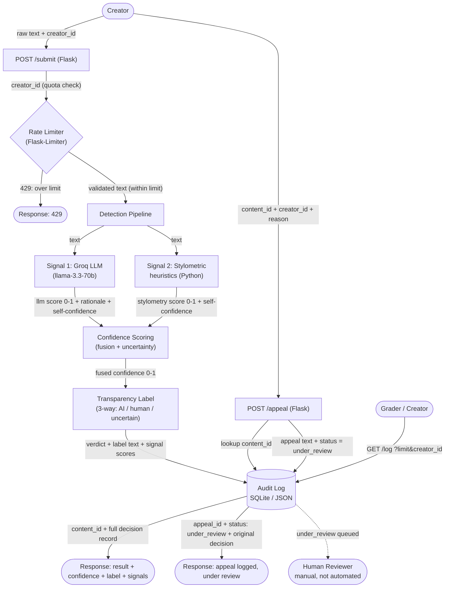

# Provenance Guard — Planning

Provenance Guard is a multi-signal AI-content classification service for a writing
platform. A creator submits text; the system estimates whether it was AI-generated,
expresses that estimate as a confidence score with honest uncertainty, attaches a
plain-language transparency label, logs the decision, and lets the creator appeal.

---

## 1. Architecture Narrative — the path one piece of text takes

This is the end-to-end story of a single submission, naming every component it touches
and what that component does.

1. **Creator → `POST /submit` (Flask API endpoint).**
   A creator sends a piece of text-based content (a poem, a short-story excerpt, a blog
   post) to the submission endpoint, along with an identifier for who they are (so we can
   rate-limit and so the audit log knows whose content this is). The endpoint is the only
   way content enters the system — it is the front door.

2. **Rate Limiter (Flask-Limiter).**
   Before any analysis happens, the request passes through the rate limiter. It checks
   how many submissions this creator (keyed by identifier / IP) has made in the current
   window. If they are within the limit, the request continues. If they have exceeded it,
   the limiter short-circuits and returns `429 Too Many Requests` — the text is never
   analyzed and nothing is written to the audit log except (optionally) the rejection.
   This protects the (paid/limited) Groq calls and stops an adversary from flooding the
   system to reverse-engineer the detector.

3. **Detection Pipeline (orchestrator).**
   The validated text is handed to the detection pipeline. The pipeline does **not** make
   the decision itself — its job is to run the text through two independent detection
   signals and collect their raw outputs. Running two signals (instead of one) is what
   makes a single signal's blind spot survivable: where one is weak, the other may still
   see clearly.

   - **Signal 1 — LLM-based judgement (Groq, `llama-3.3-70b-versatile`).**
     Sends the text to a large language model and asks it to assess how likely the text
     is to be machine-generated, returning a structured 0–1 score plus a short rationale.
     This signal captures *semantic / distributional* cues — the kinds of phrasing,
     hedging, and "averageness" that an LLM recognizes in its own family of outputs.

   - **Signal 2 — Stylometric heuristics (pure Python, no external service).**
     Computes measurable surface statistics of the text — e.g. sentence-length variance
     (burstiness), vocabulary richness / type-token ratio, punctuation and function-word
     patterns, repetition. These are turned into a 0–1 "looks-AI" score. This signal
     captures *structural / statistical* regularity that AI text tends to exhibit
     (uniform, low-variance, "smooth" writing).

   (The two signals and their blind spots are specified in detail in §2.)

4. **Confidence Scoring (with uncertainty).**
   The two signal outputs are combined into a single **confidence score** between 0 and 1.
   This module is deliberately designed so that the score *communicates uncertainty* rather
   than forcing a binary verdict: when the two signals **agree**, the combined score moves
   toward the extremes (clearly AI / clearly human); when they **disagree**, the score is
   pulled toward the uncertain middle band. The score is a calibrated design decision, not
   a raw model probability — see §5 for the exact formula and thresholds. Because a false positive (calling a
   human's work "AI") is worse than a false negative on a writing platform, the scoring is
   tuned to be cautious about high-confidence "AI" verdicts.

5. **Transparency Label (label generator).**
   The confidence score is mapped to **one of three** plain-language labels that a
   non-technical creator can understand:
   - high-confidence AI,
   - high-confidence human,
   - uncertain.
   The middle "uncertain" band is what keeps the system honest — borderline scores are
   never dressed up as certainty. (Exact verbatim label text in §6.)

6. **Audit Log (SQLite or structured JSON).**
   Every attribution decision is written to a structured, append-only audit log: a
   timestamp, the submission (or a reference to it), each signal's individual score, the
   combined confidence score, the chosen label, and the creator identifier. Later, if the
   content is appealed, the appeal is logged against this same record. The audit log is the
   canonical, queryable history of what the system decided and why.

7. **Response → Creator.**
   The endpoint returns a structured response to the creator: the attribution result, the
   confidence score, the signals used, and the human-readable transparency label.

8. **Appeal flow — `POST /appeal` (later, if contested).**
   If a creator disagrees with a classification, they submit an appeal referencing the
   original decision and including their reasoning. The system: (a) captures the creator's
   reasoning, (b) logs the appeal alongside the original decision in the audit log, and
   (c) updates the content's status to **"under review."** Automated re-classification is
   *not* required — a human reviews it. The status change and the appeal text are
   themselves audit-logged.

**One-sentence summary:** text enters at `/submit`, passes the rate limiter, is scored by
two independent detection signals, the scores are fused into an uncertainty-aware
confidence value, that value becomes a three-way transparency label, the whole decision is
written to the audit log, and the result is returned — with `/appeal` providing a logged,
human-reviewed path to contest any verdict.

---

## 2. Detection Signals

The pipeline uses **two independent signals** that measure *different properties* of the
text. They were chosen deliberately so their blind spots do not overlap: one looks at
*meaning/distribution* (needs a model), the other at *surface structure* (pure math). A
case that fools one tends not to fool the other in the same way.

### Signal 1 — LLM-based judgement (Groq, `llama-3.3-70b-versatile`)

- **What property it measures.** Semantic and distributional "fingerprint": how typical,
  hedged, smooth, and *probable* the text reads to a large language model. The LLM is asked
  to judge how likely the passage is to have been machine-generated and to return a
  structured 0–1 score with a one-line rationale.
- **Why it differs between human and AI writing.** LLMs are trained to produce
  high-probability, low-surprise continuations. Their output gravitates toward the
  statistical center of the language: balanced structure, even tone, safe word choices,
  characteristic transitions ("Moreover," "It's important to note"). Human writing carries
  more idiosyncrasy, opinion, lived specificity, and surprising turns. A model is good at
  recognizing the "averageness" of text drawn from its own family of distributions.
- **Blind spot (what it cannot capture).**
  - **AI text that was edited by a human** (or prompted to write "in a quirky voice") loses
    the tell-tale averageness and reads as human.
  - **Genuinely formulaic human writing** — corporate memos, SEO blog posts, student essays
    written to a template — looks "average" and gets flagged as AI (a false positive).
  - It is **non-deterministic and not transparent**: the same text can get slightly
    different scores on different calls, and the rationale is the model's say-so, not a
    measurable fact. It also costs a network round-trip and can fail/time out.

### Signal 2 — Stylometric heuristics (pure Python, no external service)

- **What property it measures.** Measurable *surface statistics* of the writing, computed
  deterministically from the text itself. Concretely:
  - **Burstiness** — variance/standard-deviation of sentence length. Humans mix long and
    short sentences; AI tends toward uniform mid-length sentences.
  - **Vocabulary richness** — type-token ratio (unique words ÷ total words). Measures
    lexical diversity vs. repetition.
  - **Punctuation & function-word patterns** — rates of commas, semicolons, dashes, and
    common connective words; AI often over-uses smooth connectives and even punctuation.
  - **Repetition** — repeated n-grams / phrase reuse.
  These are combined into a single 0–1 "looks-AI" score.
- **Why it differs between human and AI writing.** AI text is the product of token-by-token
  probability maximization, which produces *low-variance, regular* prose: consistent
  sentence rhythm, moderate vocabulary diversity, predictable punctuation. Human prose is
  "burstier" — irregular sentence lengths, sharper vocabulary swings, idiosyncratic
  punctuation habits. These are structural properties that survive even when the *meaning*
  looks fine, so they catch some cases the LLM misses.
- **Blind spot (what it cannot capture).**
  - **Short texts** (a few sentences, a short poem) don't give the statistics enough data —
    variance and type-token ratio are unstable on small samples, so confidence is low.
  - **It is genre-naive**: poetry, lists, dialogue, or technical writing have unusual
    surface statistics for legitimate human reasons and can be mis-scored either way.
  - **It is trivially gameable**: an adversary who knows the heuristics can deliberately
    vary sentence length and inject rare words to defeat the stylometry, while the *meaning*
    stays robotic — which is exactly where Signal 1 still has a chance.

### Why these two together

The signals fail in *different directions*: Signal 1 is fooled by human-edited or quirky
AI text and by formulaic humans; Signal 2 is fooled by short/odd-genre text and by an
adversary tuning surface stats. Neither blind spot is shared. When they **agree**, we have
real corroboration and can be confident; when they **disagree**, that disagreement is
itself the signal that we should report *uncertain* rather than guess. This directly feeds
the confidence-scoring design in §1 step 4.

---

## 3. The False-Positive Problem (worked scenario)

**Why this is the worst error.** On a writing platform, a **false positive** — labeling a
real human's work as AI-generated — is far more damaging than a false negative. It accuses
a creator of dishonesty, can hurt their reputation or reach, and erodes trust in the
platform. A false negative (missing some AI text) is a missed flag, not an accusation. The
whole system is therefore tuned to be **cautious about high-confidence "AI" verdicts**. The
spec's hint is explicit about this asymmetry, and our design has to *show* it.

### Scenario: Maya, a human poet

Maya writes a tight, polished free-verse poem. Her work happens to trip *both* signals for
legitimate reasons:

- It is **short** (12 lines) → Signal 2 (stylometry) has too little data; its variance and
  type-token ratio land in a middling, AI-ish range by accident.
- It is **clean and evenly polished** (she edits heavily) → Signal 1 (LLM) reads it as
  "smooth and average" and leans toward AI.

So both signals point loosely toward "AI." A naive binary classifier would stamp Maya's
poem **"AI-generated"** — a false accusation. Here is how Provenance Guard avoids that and,
where it can't fully avoid it, makes it recoverable:

1. **Confidence scoring reflects the uncertainty, not just the direction.**
   Even though both signals lean AI, neither is *strong*: stylometry explicitly down-weights
   its own score on short texts (it knows its blind spot), and the LLM score is mid-range,
   not extreme. The fusion produces a **moderate** confidence, not a high one. Combined with
   the deliberate false-positive caution (we require *strong, agreeing* evidence before a
   high-confidence AI verdict), the score lands in the **uncertain band**, not "high-confidence
   AI."

2. **The label says what it honestly knows.**
   Maya does not see "This is AI-generated." She sees the **uncertain** label — plain
   language along the lines of *"Our system couldn't confidently determine how this was
   written."* No accusation is made. This is exactly why the three-way label (with a real
   middle band) exists instead of a binary AI/human flag.

3. **If it still lands wrong, the creator can appeal.**
   Suppose a future, harsher case *does* get a "high-confidence AI" label in error. Maya
   hits **`POST /appeal`**, references the original decision, and writes her reasoning
   ("This is my own poem; here's my draft history"). The system:
   - captures her reasoning,
   - logs the appeal **alongside** the original decision in the audit log (both the machine
     verdict and her rebuttal now live in one record), and
   - sets the content status to **"under review,"** which removes the standing accusation
     pending a human look. Automated re-classification is *not* required — a person decides.

**What this scenario locks in for Milestone 2:**
- The fusion must **not** push to the extremes unless both signals are strong *and* agree.
- Each signal must be able to **report its own low confidence** (e.g. stylometry on short
  text) so the fusion can discount it.
- The "uncertain" band must be **wide enough** to absorb weak/conflicting evidence — erring
  toward "uncertain" is the cheap, safe failure mode; erring toward "high-confidence AI" is
  the expensive, harmful one.

---

## 4. API Surface (the contract)

This is the contract every other component implements — defined before any code. JSON over
HTTP. Three endpoints carry the core flows (`/submit`, `/appeal`, `/log`); a `/health`
endpoint is included for basic liveness.

### `POST /submit` — classify a piece of content

Accepts text, runs the pipeline, returns the attribution result + confidence + label.

**Request body**
```json
{
  "creator_id": "maya_92",
  "text": "Full text of the poem / story / blog post goes here..."
}
```

**Response `200 OK`**
```json
{
  "content_id": "c_a1b2c3",
  "attribution": "uncertain",
  "confidence": 0.58,
  "label": {
    "verdict": "uncertain",
    "text": "○ Unclear. Our system couldn't confidently tell how this text was created, so we're not making a claim either way. This often happens with very short pieces or a distinctive personal writing style."
  },
  "signals": {
    "llm": { "score": 0.61, "confidence": "medium", "rationale": "Even tone, smooth transitions." },
    "stylometry": { "score": 0.55, "confidence": "low", "note": "Text too short for reliable statistics." }
  },
  "status": "classified",
  "timestamp": "2026-06-29T14:03:21Z"
}
```

| Field | Meaning |
|-------|---------|
| `content_id` | Stable ID used to reference this decision in `/appeal` and `/log`. |
| `attribution` | One of `likely_ai` / `likely_human` / `uncertain` — the machine verdict. |
| `confidence` | 0–1 fused confidence score. |
| `label` | Human-facing transparency label (verdict + plain-language text). |
| `signals` | Per-signal raw scores and each signal's *own* confidence (transparency). |
| `status` | `classified` initially; becomes `under_review` after a successful appeal. |

**Error responses**
- `400 Bad Request` — missing/empty `content` or `creator_id`.
- `429 Too Many Requests` — rate limit exceeded (from the limiter, before analysis).

**Degraded mode (not an error):** if Signal 1 (Groq) is unavailable, `/submit` still returns
`200` using stylometry alone, with the verdict capped at `uncertain` and a `"degraded": true`
flag in the response (see §5.3 and §8 #5). The platform never hard-fails a submission because
an external API is down.

### `POST /appeal` — contest a classification

Lets a creator dispute a verdict. Captures reasoning, logs it against the original decision,
flips status to `under_review`. **No automated re-classification.**

**Request body**
```json
{
  "content_id": "c_a1b2c3",
  "creator_reasoning": "This is my own poem — I can share my draft history.",
  "creator_id": "maya_92"
}
```
(`creator_id` is optional; `content_id` and `creator_reasoning` are required.)

**Response `200 OK`**
```json
{
  "content_id": "c_a1b2c3",
  "appeal_id": "apl_x9y8z7",
  "status": "under_review",
  "message": "Your appeal has been logged. This content is now under human review.",
  "original_decision": { "attribution": "likely_ai", "confidence": 0.91 },
  "timestamp": "2026-06-29T14:20:05Z"
}
```

**Error responses**
- `404 Not Found` — `content_id` does not exist.
- `400 Bad Request` — missing `reason` or `content_id`.
- `409 Conflict` — submission is already `under_review` (cannot appeal twice).

### `GET /log` — read the audit log

Returns recent attribution decisions and appeals from the structured audit log (satisfies
the "at least 3 entries visible" requirement and is the canonical record graders rely on).

**Query params (optional):** `?limit=20`, `?creator_id=maya_92`

**Response `200 OK`**
```json
{
  "count": 3,
  "entries": [
    {
      "content_id": "c_a1b2c3",
      "creator_id": "maya_92",
      "attribution": "uncertain",
      "confidence": 0.58,
      "signals": { "llm": 0.61, "stylometry": 0.55 },
      "label": "uncertain",
      "status": "classified",
      "timestamp": "2026-06-29T14:03:21Z"
    }
    // ... more entries, including appeal records
  ]
}
```

### `GET /health` — liveness

**Response `200 OK`:** `{ "status": "ok" }`. No auth, not rate-limited; used to confirm the
service is up.

### Contract notes
- All timestamps are UTC ISO-8601.
- `content_id` is the join key across all three core endpoints — it ties a verdict, its
  audit-log entry, and any appeal together.
- The rate limiter applies to `/submit` (and `/appeal`); `/log` and `/health` are read-only.

---

## 5. Confidence Scoring & Uncertainty Representation

### 5.1 What each signal outputs

Neither signal returns a bare label. Each returns **a score and its own confidence weight**,
so the fusion can trust a signal more or less depending on how reliable it is *for this text*.

| Signal | `score` (0–1) | `weight` (0–1, self-confidence) |
|--------|---------------|----------------------------------|
| **Signal 1 — Groq LLM** | likelihood the text is AI-generated | from the model's own stated certainty: high → `1.0`, medium → `0.6`, low → `0.3` |
| **Signal 2 — Stylometry** | likelihood AI, from surface stats | from text length: `<50` words → `0.3`, `50–200` → `0.6`, `>200` → `1.0` |

Convention for `score`: **`0.0` = certainly human, `1.0` = certainly AI.** The confidence
axis is a *single* number; "high confidence human" and "high confidence AI" sit at opposite
ends, "uncertain" in the middle.

### 5.2 How the two scores combine into one confidence score

Two steps — a weighted blend, then an **agreement adjustment** that pulls *directionally*
disagreeing signals toward the uncertain middle:

```
# 1. Weighted blend (each signal trusted by its own weight)
raw = (w1 * s1 + w2 * s2) / (w1 + w2)

# 2. Agreement factor — only DIRECTIONAL conflict abstains:
#    both signals on the same side of 0.5 (both lean AI, or both lean human)
#    corroborate, even if their magnitudes differ -> agreement = 1.
#    Opposite sides = genuine conflict -> agreement shrinks toward 0.
if (s1 - 0.5) * (s2 - 0.5) >= 0:      # same side
    agreement = 1.0
else:                                  # opposite sides
    agreement = 1 - |s1 - s2|

# 3. Shrink the deviation from 0.5 by the (dis)agreement
confidence = 0.5 + (raw - 0.5) * agreement
```

This makes the design principle from §2–§3 concrete: **agreement amplifies, disagreement
abstains** — where "disagreement" means the signals point in *opposite directions*. Two
signals that both lean AI (e.g. 0.90 and 0.51) corroborate and yield a confident blend; one
at 0.9 (AI) and the other at 0.1 (human) collapse toward 0.5 (uncertain) no matter how loud
either one is. (Earlier drafts shrank on raw magnitude difference, which over-abstained when
both signals already agreed on direction — corrected during Milestone 4 testing.)

**Worked example (the Maya case from §3):** `s1=0.61, w1=0.6` (LLM medium), `s2=0.55,
w2=0.3` (stylometry low, short text). Both lean AI (same side), so `agreement = 1.0` and
`confidence = raw = (0.6·0.61 + 0.3·0.55)/0.9 = 0.59`. → lands in the **uncertain** band
(`0.30 < 0.59 < 0.75`), the safe outcome §3 requires.

**Worked example (LLM false positive, from M4 testing):** a human academic paragraph scores
`s1=0.80` (LLM fooled by formal prose) but `s2=0.40` (stylometry leans human). Opposite
sides → `agreement = 1 − 0.40 = 0.60`; `raw = (1.0·0.80 + 0.3·0.40)/1.3 = 0.71`;
`confidence = 0.5 + 0.21·0.60 = 0.62` → **uncertain**, not a false accusation. The
disagreement is exactly what saves the human writer.

### 5.3 Thresholds — and why they are asymmetric

```
confidence ≥ 0.75            →  Likely AI          (high-confidence AI)
0.30 < confidence < 0.75     →  Uncertain          (inconclusive)
confidence ≤ 0.30            →  Likely human       (high-confidence human)
```

The bands are **deliberately not symmetric around 0.5.** Because a false positive
(accusing a human) is the costly error (§3), the bar to call something **AI is high (0.75)**
while the uncertain band is wide. A `0.62` score is *not* "probably AI" — it is reported as
**uncertain**, exactly the spec's example. This is also why `0.5` does **not** flip the
label; nothing near the middle does.

**Two extra false-positive guards (beyond the threshold):**
1. **Both-lean rule:** the verdict is never `ai` unless *both* signals individually scored
   `> 0.5`. One loud signal cannot single-handedly accuse a creator.
2. **Degraded mode:** if Signal 1 (Groq) is unavailable, we do **not** let stylometry alone
   produce a high-confidence AI verdict — the result is capped at `uncertain` and the
   response notes degraded mode.

### 5.4 What "0.8 confidence" means to a user

A confidence of `0.8` means **both signals agreed the text is AI-generated, strongly enough
to clear the cautious 0.75 bar.** The user sees the *label* ("Likely AI-generated"), not the
raw number, but the number is logged and returned so the result is auditable and the
per-signal breakdown explains *why*.

---

## 6. Transparency Label Design

Three variants, one per band. They are written for a **non-technical creator**, avoid
jargon ("perplexity," "type-token ratio" never appear), and — crucially — the AI label is
phrased as an *assessment that can be wrong and appealed*, never a verdict of guilt. The
`signals` breakdown in the API response sits beneath the label for anyone who wants detail.

> **Verbatim label text (the canonical record graders rely on):**

**① High-confidence AI** (`confidence ≥ 0.75`)
> ⚠️ **Likely AI-generated.** Several independent checks strongly suggest this text was
> produced by an AI writing tool. This is an automated assessment, not a final decision, and
> no action has been taken automatically — if you wrote this yourself, you can appeal and a
> person will review it.

**② High-confidence human** (`confidence ≤ 0.30`)
> ✅ **Likely human-written.** Our checks found no strong sign that an AI tool generated this
> text.

**③ Uncertain** (`0.30 < confidence < 0.75`)
> ○ **Unclear.** Our system couldn't confidently tell how this text was created, so we're not
> making a claim either way. This often happens with very short pieces or a distinctive
> personal writing style.

Design notes:
- Only label ① carries a warning icon and the appeal pointer — that is the only label that
  could harm a creator, so it is the only one that needs a remedy attached.
- Label ③ explains *why* it's uncertain ("very short pieces or a distinctive personal writing
  style") so an uncertain result reads as honest, not evasive.
- None of the three uses the words "guilty," "cheating," or "plagiarism."

### Label review (fresh-eyes test)

Per the UX hint, I read each label cold as a non-technical creator who has never seen this
project and noted the likely misreadings, then revised:

| Issue found (original wording) | Why it's a problem | Revision |
|--------------------------------|--------------------|----------|
| "Multiple independent **signals**" | "signals" is internal jargon — a creator doesn't know what a signal is. | → "Several independent **checks**." |
| Label ① could cause **panic** ("am I banned? is my post deleted?") | The warning icon reads as a penalty; original text didn't say consequences. | Added "**no action has been taken automatically**" so the reader knows nothing happened to their work yet. |
| "not a final **judgment**" / "a **human** will review" | "judgment" sounds verdict-like; fine but softened. | → "not a final **decision**… a **person** will review it." |
| Label ③ header "**Inconclusive**" | A more advanced word than necessary for a general audience. | → "**Unclear**." |
| "distinctive personal **styles**" | Slightly abstract. | → "a distinctive personal **writing style**." |

Takeaway confirmed by the test: a cold reader of label ① now understands *(a)* it's a
maybe, not a certainty, *(b)* nothing punitive has happened, and *(c)* there's a way to push
back — which is exactly the fairness posture from §3.

---

## 7. Appeals Workflow

| Question | Answer |
|----------|--------|
| **Who can appeal?** | The creator who owns the submission (`creator_id` must match the original). |
| **Via what?** | `POST /appeal` with `content_id` and a free-text `creator_reasoning` (`creator_id` optional). |
| **What info do they provide?** | Their reasoning — why they believe the classification is wrong (e.g. "this is my own poem, here's my draft history"). |
| **What does the system do?** | (1) validates the `content_id` exists; (2) writes an **appeal record** to the audit log, linked to the original decision; (3) updates the submission `status` from `classified` → `under_review` and attaches the `creator_reasoning`; (4) returns an `appeal_id` and confirmation. |
| **What gets logged?** | A new appeal record (`appeal_id`, `content_id`, `creator_reasoning`, snapshot of the original verdict/confidence, timestamp) **and** the submission row is updated with `status=under_review` + `creator_reasoning`. The original decision fields (attribution, confidence, signal scores) are **never overwritten** — the appeal sits beside them. |
| **Automated re-classification?** | **No.** Status becomes `under_review` and stops there; a human decides. (Per spec, automated re-classification is explicitly not required.) |
| **What does a human reviewer see when they open the queue?** | All `under_review` items via `GET /log?status=under_review`: the original text, both signal scores + weights, the fused confidence, the label shown, **and** the creator's appeal reason — everything needed to make a call, in one record. |

**Guards:** appealing a non-existent submission → `404`; missing `reason`/`content_id` →
`400`; appealing something already `under_review` → `409` (no double appeals).

---

## 8. Anticipated Edge Cases

Specific scenarios the system must handle, with the concrete behavior for each.

1. **Short text (haiku, 12-line poem, one-paragraph blurb).**
   Stylometry has too few sentences for stable variance/TTR. → Its `weight` drops to `0.3`,
   so the fusion barely trusts it; results gravitate to **uncertain** unless the LLM is very
   confident. (This is the Maya scenario, §3.)

2. **Repetitive, simple-vocabulary human writing (children's story, song with a refrain,
   a list poem).**
   Low burstiness + low type-token ratio make stylometry shout "AI" even though it's human —
   a classic false positive. → The both-lean guard + agreement adjustment mean that unless
   the LLM *also* leans AI, the conflict collapses the score toward `0.5` → **uncertain**,
   not "AI." If it still lands wrong, the appeal path (§7) is the safety net.

3. **Adversarially humanized AI text.**
   An adversary who knows the heuristics injects rare words and varies sentence length to
   beat stylometry. → Stylometry is defeated, but Signal 1 still judges the *meaning* as
   machine-like; because they now disagree, the system reports **uncertain** rather than
   being confidently fooled into "human." Documented as a known limitation, not a solved
   problem.

4. **Non-text / empty / junk input** (whitespace only, pure punctuation/emoji, < a handful
   of words). → Rejected at validation with `400` before any signal runs — no audit entry,
   no wasted Groq call.

5. **Signal 1 (Groq) outage or timeout.** → Caught; the pipeline runs in **degraded mode**
   on stylometry alone, the verdict is capped at `uncertain` (§5.3 guard), and the response
   notes the degradation. The platform never hard-fails a submission because of an external
   API.

6. **Very long submission.** → Capped at a max character length; text beyond the cap is
   truncated for analysis (and the truncation is noted), keeping latency and Groq cost
   bounded — this also blunts a flood-with-huge-payloads attack alongside the rate limiter.

---

## Architecture

**Submission flow:** a creator POSTs text to `/submit`, which passes the rate limiter, fans
the text out to both detection signals, fuses their scores into one uncertainty-aware
confidence value (§5), maps that value to one of three transparency labels (§6), writes the
full decision to the audit log, and returns the result. **Appeal flow:** a creator POSTs to
`/appeal` with their reasoning; the system logs the appeal beside the original decision,
flips the submission status to `under_review`, and hands it to a human — no automated
re-classification. This diagram is the reference for the AI Tool Plan below and travels into
Milestones 3–5.

Two main flows. Each arrow is labeled with **what passes between components**.

### Mermaid



### ASCII fallback

```
SUBMISSION FLOW
  Creator
    | raw text + creator_id
    v
  POST /submit (Flask)
    | creator_id (quota check)
    v
  Rate Limiter (Flask-Limiter) ---- over limit ----> [429 Response]
    | validated text (within limit)
    v
  Detection Pipeline
    |--- text --->  Signal 1: Groq LLM (llama-3.3-70b)
    |--- text --->  Signal 2: Stylometric heuristics (Python)
                          |                         |
        llm score+rationale+self-conf      stylometry score+self-conf
                          v                         v
                  Confidence Scoring (fusion + uncertainty)
                          | fused confidence 0-1
                          v
                  Transparency Label (AI / human / uncertain)
                          | verdict + label text + signal scores
                          v
                  Audit Log (SQLite / JSON)
                          | content_id + full decision record
                          v
                  [Response: result + confidence + label + signals]

APPEAL FLOW
  Creator
    | content_id + creator_id + reason
    v
  POST /appeal (Flask)
    | lookup content_id, then write appeal text + status=under_review
    v
  Audit Log  ----> appeal_id + status:under_review + original decision --> [Response]
            \---- under_review queued ---> Human Reviewer (manual, not automated)

READ FLOW
  Grader/Creator --- GET /log ?limit&creator_id ---> Audit Log --> [recent entries]
```

---

## AI Tool Plan

How this spec drives code generation across the three implementation milestones. For each:
**which spec sections to hand the AI tool**, **what to ask it to generate**, and **how to
verify** the output before wiring it in.

### M3 — Submission endpoint + first signal

- **Spec sections to provide:** §2 (Signal 1 definition), §4 (`POST /submit` contract),
  §5.1 (LLM output shape: `score` + `weight`), and the **Architecture** diagram.
- **What to ask for:** a Flask app skeleton with a `POST /submit` route that validates input
  (§4 errors), plus a single `detect_llm(text)` function that calls Groq
  (`llama-3.3-70b-versatile`), prompts it to return a JSON `{score, confidence, rationale}`,
  and parses that into the §5.1 shape. Stub the second signal and scoring for now.
- **How to verify:** call `detect_llm()` **directly** on a few inputs (a known ChatGPT
  paragraph, a hand-written paragraph, an empty string) *before* exposing it through the
  endpoint — confirm scores point the right way and the JSON parses. Then `curl /submit`
  and check the response matches the §4 schema and that `400`/`429` fire correctly.

### M4 — Second signal + confidence scoring

- **Spec sections to provide:** §2 (Signal 2 definition + blind spots), §5.1 (stylometry
  output + length-based `weight`), §5.2 (the fusion formula), §5.3 (thresholds + guards),
  and the diagram.
- **What to ask for:** a pure-Python `detect_stylometry(text)` returning `{score, weight}`
  from burstiness / TTR / punctuation / repetition, and a `score_confidence(s1, s2)` that
  implements the §5.2 blend + agreement adjustment and applies the §5.3 thresholds, both-lean
  rule, and degraded-mode cap.
- **How to verify:** unit-check that the **scores map to meaningfully different labels** —
  feed (high, high) → `ai`; (low, low) → `human`; (0.9, 0.1) → `uncertain` (must collapse to
  ~0.5, *not* flip at 0.5); and re-run the Maya numbers → expect `≈0.585` / uncertain. This
  is the explicit M2-checkpoint test that scoring isn't a binary flip.

### M5 — Production layer (labels, appeals, rate limit, audit log)

- **Spec sections to provide:** §6 (the three verbatim label variants), §7 (appeals
  workflow), §4 (`/appeal` + `/log` contracts), the rate-limit decision (README/§Rate
  limiting), and the diagram.
- **What to ask for:** a `make_label(verdict, confidence)` returning the exact §6 text; the
  `POST /appeal` route (log appeal beside original, set `under_review`, §7 guards); the audit
  log writer/reader behind `GET /log`; and Flask-Limiter config on `/submit` and `/appeal`.
- **How to verify:** confirm **all three label variants are reachable** by submitting texts
  engineered to land in each band; submit → appeal → re-read `/log` and confirm the status
  flipped to `under_review` and the appeal row sits beside (not over) the original; hammer
  `/submit` past the limit and confirm `429`.

---

## Stretch Features

None started yet. This section will be updated **before** beginning any stretch feature
(candidates: ensemble weighting/voting, provenance certificate, analytics dashboard,
multi-modal support), documenting what is built and how, per the project rules.
